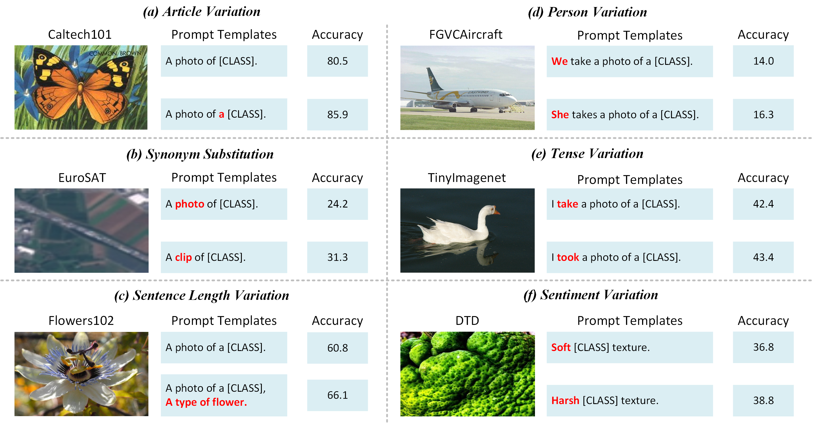
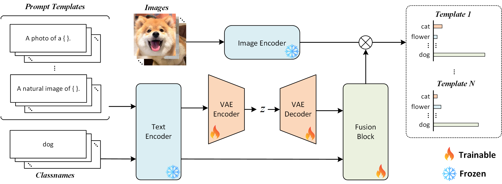

# MVP: Modeling Variants of Prompts for Vision-Language Models

**Ao Li***, **Zongfang Liu***, **Xinhua Li**, **Jinghui Zhang**, **Pengwei Wang**† , **Hu Wang**† 

- *Equal contribution  
- †Corresponding author

Our paper: [arxiv](https://arxiv.org/abs/2503.08229)

## Introduction
We introduce the RobustPrompt Benchmark, a systematic benchmark to evaluate robustness to different prompt templates for VLMs. It includes a dataset with hundreds of carefully designed prompt templates, divided into six types, covering a wide variety of commonly used templates. 

<div align="center">
  
</div>

Beside the benchmark, we propose Modeling Variants of Prompts (MVP), a simple yet effective method that mitigates sensitivity by modeling variants of prompt structures. The innovation of MVP lies in decoupling prompts into templates and class names, and using Variational Autoencoders (VAE) to model the distribution of diverse prompt structures. 

<div align="center">
  
</div>

## Requirements
```bash
# Install dassl
git clone https://github.com/KaiyangZhou/Dassl.pytorch.git
cd Dassl.pytorch/
conda create -y -n dassl python=3.8
conda activate dassl
conda install pytorch torchvision cudatoolkit=10.2 -c pytorch
pip install -r requirements.txt
python setup.py develop

# Download our code
git clone https://github.com/xiaoyaoxinyi/MVP.git
```

## How to run
```bash
# Please refer to https://github.com/KaiyangZhou/CoOp
bash script/promptclip/main.sh dataset rn50 16
```

## How to evaluate
```bash
# Please refer to https://github.com/KaiyangZhou/CoOp
bash script/promptclip/eval.sh dataset rn50
```

## Cite us
```
@misc{li2025modelingvariantspromptsvisionlanguage,
      title={Modeling Variants of Prompts for Vision-Language Models}, 
      author={Ao Li and Zongfang Liu and Xinhua Li and Jinghui Zhang and Pengwei Wang and Hu Wang},
      year={2025},
      eprint={2503.08229},
      archivePrefix={arXiv},
      primaryClass={cs.CV},
      url={https://arxiv.org/abs/2503.08229}, 
}
```
